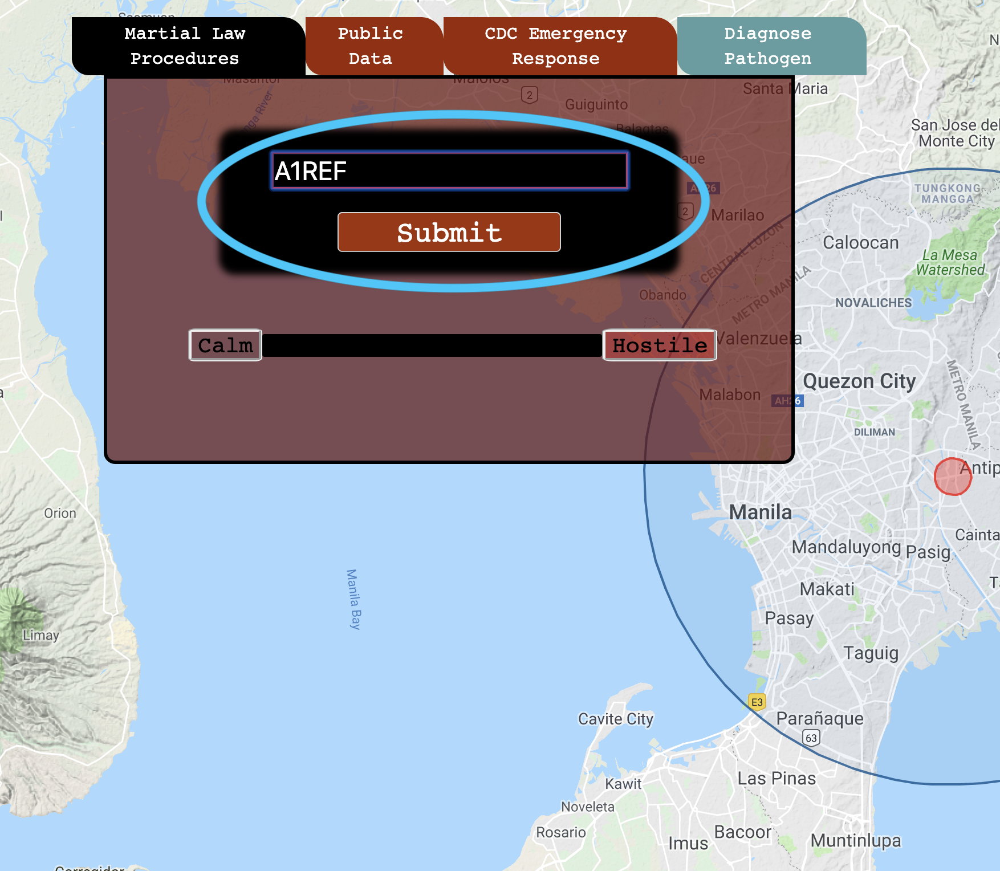

<div style='font-family:monospace'>

<div style="text-align:center;">
<h1 style="text-align:center;margin-top:15vh;background:black;border-radius:10px">Contagion Control</h1>

<h3 style="text-align:center;">Desc: A survival game based on the basics of epedimiology... <br>
Type: Project-1 <br>
Creator: Alex Hughes</p><br>
<p style="text-align:center; text-decoration:underline">Competencies:</p></h3> <ul style="list-style:none;margin-left:-6vw">
<li>Google Maps API</li>
<li>jQuery</li>
<li>HMTL/CSS/Javascript</li>
<li>DOM event listeners</li>
</ul><br>
</div>

```js
SATELLITE_FEED_FAIL: {$:false};
SHA_DYNAMIC_HANDSHAKE: true;
alert(INCOMING_MESSAGE);
FROM:
                   `_  __  __    __   _____ _____
                   / |/ // _ ) / _ | / ___// ___/
                  /    // _  |/ __ |/ /__ / /__  
                 /_/|_//____//_/ |_|\___/ \___/ 

      National Biodefense Anaylsis and Countermeasures Center
>>>>>>>>>>>>>>>>>>>>>>>>>>>>>>>>>>>>>>>>>>>>>>>>>>>>>>>>>>>>>>>>>>
                Please read the below information 
                for intellegence and knowledge 
                gathering on your next assignment.
```
# Starting Out:


#### Upon reaching the start page you are greeted with an initilization of the situation that you are about to be thrown into. It gives you three key tools at your disposal:

<ul>
<li style="font-weight:600">Personal Terminal</li>
<p>This is a hard-line terminal with direct access to camera feed and personal data of everyone in the quarantine zone. Using this is the key to making the important decisions at a distance, maintaining control of the outbreak and using the data to diagnose the disease before it gets to critical mutation levels.</p>
<li style="font-weight:600">Government Ref. Codes</li>
<p>This is your main reference for SHA encoded commands between Main HQ and your personal terminal to issue to the Immediate Contingency Government in command within the Quarantine Zone.</p>
<li style="font-weight:600">Disease Ref. Guide</li>
<p>This is a reference book that has been given to you by the NBACC (National Biodefense Analysis and Countermeasures Center)
Its containments are the collected databases of several secret biological diseases known to have been stolen or biological structure leaked to hostile contries.</p>
</ul>


# ```User Interface```

#### 1. [Martial Law Procedures](#-```Martial-Law-Procedures```)
#### 2. [Public Data](#-```Public-Data```)
#### 3. [CDC Emergency Response](#-```CDC-Emergency-Response```)
> #### a. [Sub Buttons](#-```Sub-Buttons```)
#### 4. [Diagnose Pathogen](#-```Diagnose-Pathogen```)
#### 5. [Personal Terminal](#-```Personal-Terminal```)


---

### ```Wireframe: Creation of Contagion Control```
#### Will be uploading a wireframe collection soon!


---
<h1 style="font-size:7vh; text-decoration: underline; text-align:center">Main Menu Details:</h1>

# ```Martial Law Procedures```

#### Located at the top left of the screen:


This is the interface that you will use ```throughout the game``` to issue commands in the form of ```Reference Codes``` to the acting government within the Quarantine Zone. Depending on your choices you make it will determine:
<br/>
<br/>

1. How quickly the disease spreads.
2. How frantic the Public becomes.
3. How hostile the Government becomes.<br/>(Indicated by the arrow in the above photo)
4. How quickly the cure is developed.

<br/>

```Reference Codes``` are located within the ```CDC Emergency Response``` tab.
<br/>


To implement them type them into the ```CDC~EOCIMS@.REF~CODE``` input box and click ```Submit```.



---
# ```Public Data```

Located at the top left of the screen:


The Public Data tab lets you access information pertaining to:


1. Healthy Population
2. Infected Population
3. Public Reactivity Scope: <br/>Pertains to state of Public Unrest.<br/> If it gets too high, they will make decisions on their own and hinder progress. Thus effecting surrounding variables such as Government Hostility, Cure Development, and Disease Spread.


---

# ```Diagnose Pathogen```

Located on the far right of the tabs:


---

This is the window in which you input your suspected ```pathogen``` in an effort to diagnose and boost productivity of the ```cure```.

Once the disease type is discovered, Doctors in the hot-zones can more accurately treat and care for those infected.

Choose incorrectly, however, and research for the ```cure``` will be severely set back. Costing you precious time, and lives...

---

# ```CDC Emergency Response```

Located at the top left of the screen:


---

#### *This is your main source of actionable content* ####

#### To the far left is the EOCIMS (Emergency Operations Center Incident Management System) Ref. Codes button.<br/>
Located within this button are the Reference Codes talked about above. 

#### To the center is the NBACC Contagion Ref. Guide: <br/>
This is your go-to when attempting to diagnose and treat the contagion before it mutates and spreads at an exponential rate.
Utilizing the information in this button is critical to your success and the survival of all the people within the Quarantine Zone.

#### The Third button is //EMNBACC PROTOCOL//:

?===~ _INFORMATION ##REDACTED##_<br/>


#### Below these two buttons in the CDC Emergency Response Window are the progress bars for:

#### 1.Cure Development:<br/>
This is a live feed to the progress in the research labs working day and night to figure out how to fight the disease and synthesize a cure for it. Should this goal be reached, it will be developed and distributed as quickly as technology allows.

#### 2. Pathogen Level:<br/>

Depending on the kind of Pathogen, it will start to spread and develop at an aggressive rate. Death and Infection rates will spike, and both Public and Governmental unrest will rise. 

Determining the type of disease (viral, bacterial, prion, bioweapon, etc...) will help in lowering the Pathogen level by allowing you to make the right decsions.<br/><br/>
**NOTE**: Making decisions that do not pertain to the type of the disease will not help, but allow the disease to spread.<br/>


The spread of said disease will be translated from interception of infected via satellite encryption to your Google MAPS compliant viewing tool:


Unfortunately due to the high-sensitivity of this situation, heavy encryption is required, and our satellite is only able to update you once per day...


```css
Do not allow this bar to reach critical, or we will be forced to intervene...
```
---


# ```Sub-Buttons```

### ```EOCIMS Ref. Codes```

Clicking on this button will result in the following drop-down:


---

Each of these ```Ref. Codes``` contains a unique command to issue to the Acting Emergency Government. If clicked, a modal will show with the relevant information:


It is up to you as the Controller of this outbreak to choose which decision is in the best interest of the ```Acting Government```, ```the People```, and the ```Cure```.

Making the incorrect choices can lead to cascading failures leading to societal collapse. ```Be wary...```

---

### ```NBACC Contagion Ref. Guide```

Clicking on this button will lead to the dropdown of the ```NBACC Case Files Folder```:


---

Within this folder contains the entire database of known diseases believed to be of significant threat to your case. Clicking on a tab will open the file containing information on that specific disease case:


---

This is the core of what leads to your diagnosal of the disease. 

Utilizing the Symptoms, Treatment Specifications, and understanding how to treat its disease type, will determine the success of your campaign.

---

# ```Personal Terminal```

This is your main point of contact between ```us```, and all the events within the ```Quarantine Zone```.

#### Keep a keen eye on the events logged during each day.

During times of stress, information gathered from the Personal Terminal can be a great indicator of areas you need to improve:


---

#### ```New symptoms``` that have appeared in the hot-zones will be directly reported to your ```terminal```.


Miss these, and we will never find out what disease is spreading through the area.

---
<br/>
---
---

<h1 style="background:black; text-align: center;font-size:7vh">Ending</h1>

You must find a ```cure```.<br/>


```js

#### `We have the utmost confidence in our selection. While this event is like nothing we have yet seen, your qualifications and experience make you the prime candidate for this operation's success, ${AgentNameHere}.`

#### `We wish you the best of luck.
```
```js
AREA_SIGNAL: {if(null!=true) {connection=false}}
......
GEOSTATIONARY_SATELLITE_BOUNCEBACK: {$:true}
........
>>>>>>> {CONNECTION:TERMINATED}
```


</div>